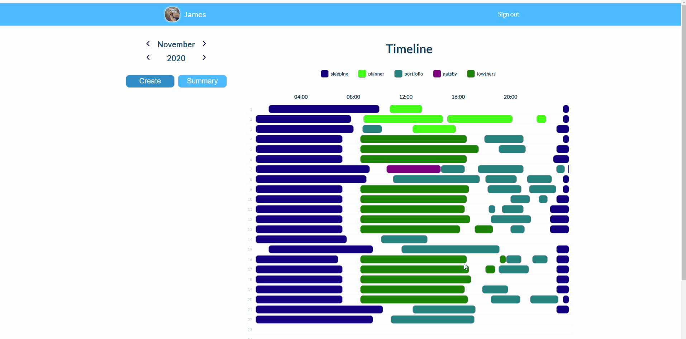

# Task Tracker/Time Management Application

A hybrid server/client-side rendered WebApp using Node.js Express routing to deliver PUG templated pages to the client, which are then handled by front-end JavaScript. The database is MongoDB, interacted with using Mongoose. Authentication is implemented with JWT.

**Hosted on Heroku**
https://fathomless-journey-08641.herokuapp.com/
_[ Allow up to 30 seconds for the server to start ]_

Create an account to start using the app.

## Summary

This was my first project, completed 3 months after first starting to learn HTML and CSS. When I decided to commit to a career change I knew I needed a reliable way of tracking the amount of time I was dedicating to the task, to keep me accountable, as well as remind myself how far I had progressed, to help me stay motivated when things were not going well. Initially, I was using Excel spreadsheets for this purpose, but this was hard to manage and lacked any easy way of generating basic stats about my allocations of time. I wanted a visual representation of my time management, as well as basic stats. I could not find an application that I was happy with, so to consolidate my knowledge, I decided to build one.

## What I learned

A lot. Primarily, this consolidated my recently acquired knowledge of CSS and JavaScript, and forced me to apply HTML in the slightly different format demanded by PUG templates. In addition to this, I learned about the MVC architecture, Node.js, MongoDB, Express, Axios, asynchronous JavaScript, JWT authentication, error handling, local storage, and reading and writing files. I built a backend API for the front-end to communicate with, and tested it using Postman and MongoDB Compass, as well as learning the first stages of Git, and package management with npm. This project was exactly what I needed at the time, and it allowed me to get a little experience with a large number of things all at once, as well as presenting enough challenges and setbacks to keep me on my toes.

## Features

- Sign in/out and Sign up
- Create/Read/Update/Delete for logs entered
- Basic colour picker
- Shared colors over logs of the same name
- Basic summary of each type of log in the month
- Predictive average time per week in the month
- Smart text colour (between black and white) based on background
- Mobile responsive

## Technologies Used

- HTML
- CSS
- JavaScript
- PUG
- Axios
- Node.js
- Express
- MongoDB
- Mongoose
- JWT
